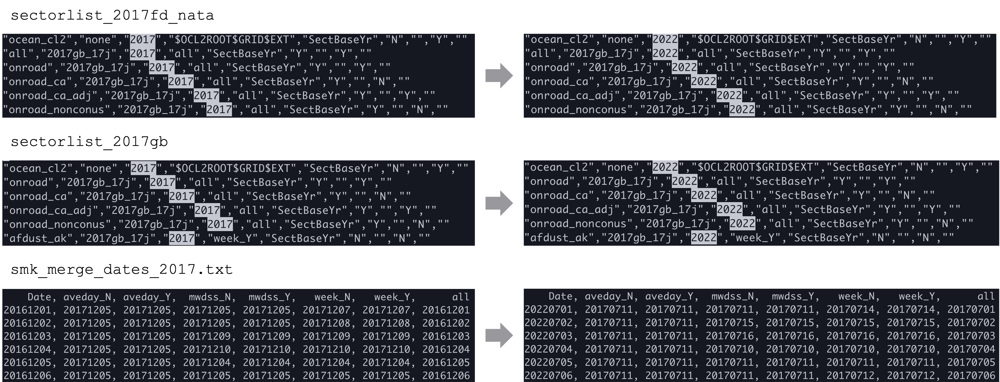

# Getting familiar with WRF-Chem

<button onclick="window.scrollTo({ top: 0, behavior: 'smooth' });" style="position: fixed; bottom: 20px; right: 20px; background-color: #919497; color: white; border: none; padding: 8px 10px; cursor: pointer; border-radius: 5px; font-size: 30px;">
  🔝
</button>

## Overview
In this section, you will learn how to:
* Include anthropogenic emissions using [the EPA_ANTHRO_EMIS tool](#epa_anthro_emis).
* Set up a [WRF-Chem simulation](#wrf-chem).

## The EPA_ANTHRO_EMIS tool
The EPA_ANTHRO_EMIS tool allows the user to create WRF-Chem compatible hourly anthropogenic emission input files from Sparse Matrix Operator Kernel (SMOKE) Modeling System netcdf output.

### Preparation
**1.** Download the [source code](https://www.acom.ucar.edu/wrf-chem/download.shtml) and [NEI input data](https://www2.acom.ucar.edu/wrf-chem/wrf-chem-tools-community).

**2.** Build `anthro_emis` by executing the following commands:
```shell
# set the fortran compiler
export FC=gfortran

# check the NetCDF installation path
nc-config --prefix

# set the NetCDF directory path
export NETCDF_DIR=/sw/netcdf4-4.7.4-gnu-9.3.0

# compile anthro_emis
./make_anthro
```

**3.** Prepare `wrfinput_d<nn>` file.
* Move to the WRF directory in which you plan to run the code.
```shell
cd ~/WRF/test/em_real
```
* Edit `namelist.input`, set the following:
  * start time and end time
  * `chem_opt = 0`
  * `io_style_emissions = 2`
* Run real.exe to generate a `wrfinput_d01` file

### Run `anthro_emis`
**1.** Move to the EPA_ANTHRO_EMIS directory.
```shell
cd ../../../EPA_ANTHRO_EMIS
```
**2.** Copy `wrfinput_d<nn>` file.
```shell
cp ~/WRF/test/em_real/wrfinput_* .
```
**3.** Create `anthro_emis.inp` file and edit ([example](#an-example-of-anthro_emisinp)).

**4.** To run anthro_emis issue the command:
```shell
./anthro_emis < anthro_emis.inp
```

<div style="background-color: #eafaf1; border-left: 5px solid #4CAF50; padding: 5px 10px 5px 10px;">
  <strong style="color: #4CAF50">Check:</strong> 
  
  Output will be in the format of <code>wrfchemi_d01_YYYY-MM-DD_HH:mm:ss</code>.
</div>

### Applying NEI emissions to other years

<span style="font-size: 13px;">_The instructions below were adapted from the [NCAR Discussion Forum](https://groups.google.com/a/ucar.edu/g/wrf-chem-anthro_emiss/c/DCJBfkmrRZs/m/Mq4_IgU_CwAJ)._</span>

If you want to translate NEI 2014/2017 emissions to alternate years, follow these steps:

**1.** Modify the `epa.f90` file.

Change:
```fortran
dateHdr(7) = &
(/ 'all     ', 'aveday_N', 'aveday_Y', 'mwdss_N ', 'mwdss_Y ', 'week_N  ', 'week_Y'  /)
```

To:
```fortran
dateHdr(8) = &
(/ 'date     ', 'aveday_N', 'aveday_Y', 'mwdss_N ', 'mwdss_Y ', 'week_N  ', 'week_Y'  , 'all' /)
```

**2.** Change all instances of 7 to 8.

**3.** Rebuild `anthro_emis`.

**4.** Modify the `smk_merge_year_change_v3_bak.xls` ([click to download](https://github.com/yicenl2/wrf-partmc-tutorial/raw/refs/heads/main/assets/file/smk_merge_year_change_v3_bak.xlsx)) to include conversions for the year you want to simulate. 

✨ TIP: You may need to change columns D, K, M, and V.

**5.** Save the first 8 columns as a `.csv` file, then change the file extension to `.txt`. 

❗ IMPORTANT: Ensure that the indentations are correct in the saved .txt file to avoid errors!

**6.** Change names (or make copies) of the following files so that the year matches the one you're interested in.

* `sectorlist_2017fd_nata`
* `sectorlist_2017gb`
* `smk_merge_dates_2017.txt`

💡 <ins>*An example of replacing "2017" with "2022":*</ins>



## WRF-Chem
**1.** Move to the WRF directory.
```shell
cd ../WRF/test/em_real
```
**2.** Link *or* copy the `wrfchemi*` files generated in previous steps.
```shell
# To link the files:
ln -sf ../../../EPA_ANTHRO_EMIS/wrfchemi_d01_* .

# To copy the files:
cp ../../../EPA_ANTHRO_EMIS/wrfchemi_d01_* .
```

**3.** Edit the `namelist.input` ([example](#an-example-of-namelistinput-with-chemistry)).

✨ TIP: Pay attention to the following parameters:
* `chem_opt = 8`
* `io_style_emissions = 2`
* `emiss_opt=3` (NEI emissions for USA)
* `emiss_inpt_opt = 1`
* `kemit = 1`
* `emi_inname = "wrfchemi_d<domain>_<date>"`
* `auxinput5_interval_m = 60`
* `frames_per_auxinput5 = 1` ❗ Add this line to ensure WRF reads the `wrfchemi*` files correctly.

## An example of anthro_emis.inp
```fortran
&CONTROL
 wrf_dir    = '.'
 anthro_dir = '/PATH_TO_THE_NEI_EMISSION_DATA/'
 src_lon_dim_name = 'COL'
 src_lat_dim_name = 'ROW'
 domains = 1

 output_interval    = 3600
 sec_file_prefix = 'emis_mole_'
 sec_file_suffix = '_12US1_nobeis_norwc_2017gb_17j.ncf'
 stk_file_prefix = 'inln_mole_'
 stk_file_suffix = '_12US1_cmaq_cb6ae7_2017gb_17j.ncf'
 stk_grp_file_suffix = '_12US1_2017gb_17j.ncf'

 src_names(1:8) = 'all:epa-sector','cmv_c1c2_12:epa-stack','cmv_c3_12:epa-stack','othpt:epa-stack','ptegu:epa-stack','ptnonipm:epa-stack','pt_oilgas:epa-stack','rwc:epa-sector'
 sub_categories(1:10)   = 'CO','NO','NO2','SO2','NH3','ETOH','PAR','IOLE','ETH','ETHA'
 sub_categories(11:20)  = 'OLE','PRPA','FORM','ALD2','ALDX','ACET','MEOH','KET','TOL','BENZ'
 sub_categories(21:25)  = 'XYLMN','ISOP','TERP','SULF','ETHY'
 sub_categories(26:32)  = 'PMOTHR','PEC','POC','PMC','PSO4','PNO3','PNH4'

 start_output_time = '2022-07-05_00:00:00'
 stop_output_time  = '2022-07-07_00:00:00'
 emissions_zdim_stag = 10

 emis_map(1) = 'CO->all(CO)+cmv_c1c2_12(CO)+cmv_c3_12(CO)+othpt(CO)+ptegu(CO)+ptnonipm(CO)+pt_oilgas(CO)+rwc(CO)'
 emis_map(2) = 'NO->all(NO)+cmv_c1c2_12(NO)+cmv_c3_12(NO)+othpt(NO)+ptegu(NO)+ptnonipm(NO)+pt_oilgas(NO)+rwc(NO)'
 emis_map(3) = 'NO2->all(NO2)+cmv_c1c2_12(NO2)+cmv_c3_12(NO2)+othpt(NO2)+ptegu(NO2)+ptnonipm(NO2)+pt_oilgas(NO2)+rwc(NO2)'
 emis_map(4) = 'SO2->all(SO2)+cmv_c1c2_12(SO2)+cmv_c3_12(SO2)+othpt(SO2)+ptegu(SO2)+ptnonipm(SO2)+pt_oilgas(SO2)+rwc(SO2)'
 emis_map(5) = 'NH3->all(NH3)+cmv_c1c2_12(NH3)+cmv_c3_12(NH3)+othpt(NH3)+ptegu(NH3)+ptnonipm(NH3)+pt_oilgas(NH3)+rwc(NH3)'
 emis_map(6) = 'C2H5OH->all(ETOH)+cmv_c1c2_12(ETOH)+cmv_c3_12(ETOH)+othpt(ETOH)+ptegu(ETOH)+ptnonipm(ETOH)+pt_oilgas(ETOH)+rwc(ETOH)'
 emis_map(7) = 'BIGALK->.2*all(PAR)+.2*cmv_c1c2_12(PAR)+.2*cmv_c3_12(PAR)+.2*othpt(PAR)+.2*ptegu(PAR)+.2*ptnonipm(PAR)+.2*pt_oilgas(PAR)+rwc(PAR)'
 emis_map(8) = 'BIGENE->all(IOLE)+cmv_c1c2_12(IOLE)+cmv_c3_12(IOLE)+othpt(IOLE)+ptegu(IOLE)+ptnonipm(IOLE)+pt_oilgas(IOLE)+rwc(IOLE)'
 emis_map(9) = 'C2H4->all(ETH)+cmv_c1c2_12(ETH)+cmv_c3_12(ETH)+othpt(ETH)+ptegu(ETH)+ptnonipm(ETH)+pt_oilgas(ETH)+rwc(ETH)'
 emis_map(10) = 'C2H6->all(ETHA)+cmv_c1c2_12(ETHA)+cmv_c3_12(ETHA)+othpt(ETHA)+ptegu(ETHA)+ptnonipm(ETHA)+pt_oilgas(ETHA)+rwc(ETHA)'
 emis_map(11) = 'C3H6->all(OLE)+cmv_c1c2_12(OLE)+cmv_c3_12(OLE)+othpt(OLE)+ptegu(OLE)+ptnonipm(OLE)+pt_oilgas(OLE)+rwc(OLE)'
 emis_map(12) = 'C3H8->all(PRPA)+cmv_c1c2_12(PRPA)+cmv_c3_12(PRPA)+othpt(PRPA)+ptegu(PRPA)+ptnonipm(PRPA)+pt_oilgas(PRPA)+rwc(PRPA)'
 emis_map(13) = 'CH2O->all(FORM)+cmv_c1c2_12(FORM)+cmv_c3_12(FORM)+othpt(FORM)+ptegu(FORM)+ptnonipm(FORM)+pt_oilgas(FORM)+rwc(FORM)'
 emis_map(14) = 'CH3CHO->all(ALD2+ALDX)+cmv_c1c2_12(ALD2+ALDX)+cmv_c3_12(ALD2+ALDX)+othpt(ALD2+ALDX)+ptegu(ALD2+ALDX)+ptnonipm(ALD2+ALDX)+pt_oilgas(ALD2+ALDX)+rwc(ALD2+ALDX)'
 emis_map(15) = 'CH3COCH3->all(ACET)+cmv_c1c2_12(ACET)+cmv_c3_12(ACET)+othpt(ACET)+ptegu(ACET)+ptnonipm(ACET)+pt_oilgas(ACET)+rwc(ACET)'
 emis_map(16) = 'CH3OH->all(MEOH)+cmv_c1c2_12(MEOH)+cmv_c3_12(MEOH)+othpt(MEOH)+ptegu(MEOH)+ptnonipm(MEOH)+pt_oilgas(MEOH)+rwc(MEOH)'
 emis_map(17) = 'MEK->all(KET)+cmv_c1c2_12(KET)+cmv_c3_12(KET)+othpt(KET)+ptegu(KET)+ptnonipm(KET)+pt_oilgas(KET)+rwc(KET)'
 emis_map(18) = 'TOLUENE->all(TOL)+cmv_c1c2_12(TOL)+cmv_c3_12(TOL)+othpt(TOL)+ptegu(TOL)+ptnonipm(TOL)+pt_oilgas(TOL)+rwc(TOL)'
 emis_map(19) = 'BENZENE->all(BENZ)+cmv_c1c2_12(BENZ)+cmv_c3_12(BENZ)+othpt(BENZ)+ptegu(BENZ)+ptnonipm(BENZ)+pt_oilgas(BENZ)+rwc(BENZ)'
 emis_map(20) = 'XYLENE->all(XYLMN)+cmv_c1c2_12(XYLMN)+cmv_c3_12(XYLMN)+othpt(XYLMN)+ptegu(XYLMN)+ptnonipm(XYLMN)+pt_oilgas(XYLMN)+rwc(XYLMN)'
 emis_map(21) = 'ISOP->all(ISOP)+cmv_c1c2_12(ISOP)+cmv_c3_12(ISOP)+othpt(ISOP)+ptegu(ISOP)+ptnonipm(ISOP)+pt_oilgas(ISOP)+rwc(ISOP)'
 emis_map(22) = 'C10H16->all(TERP)+cmv_c1c2_12(TERP)+cmv_c3_12(TERP)+othpt(TERP)+ptegu(TERP)+ptnonipm(TERP)+pt_oilgas(TERP)+rwc(TERP)'
 emis_map(23) = 'sulf->all(SULF)+cmv_c1c2_12(SULF)+cmv_c3_12(SULF)+othpt(SULF)+ptegu(SULF)+ptnonipm(SULF)+pt_oilgas(SULF)+rwc(SULF)'
 emis_map(24) = 'C2H2->all(ETHY)+cmv_c1c2_12(ETHY)+cmv_c3_12(ETHY)+othpt(ETHY)+ptegu(ETHY)+ptnonipm(ETHY)+pt_oilgas(ETHY)+rwc(ETHY)'
 emis_map(25) = 'PM_25(A)->all(PMOTHR)+cmv_c1c2_12(PMOTHR)+cmv_c3_12(PMOTHR)+othpt(PMOTHR)+ptegu(PMOTHR)+ptnonipm(PMOTHR)+pt_oilgas(PMOTHR)+rwc(PMOTHR)'
 emis_map(26) = 'BC(A)->all(PEC)+cmv_c1c2_12(PEC)+cmv_c3_12(PEC)+othpt(PEC)+ptegu(PEC)+ptnonipm(PEC)+pt_oilgas(PEC)+rwc(PEC)'
 emis_map(27) = 'OC(A)->all(POC)+cmv_c1c2_12(POC)+cmv_c3_12(POC)+othpt(POC)+ptegu(POC)+ptnonipm(POC)+pt_oilgas(POC)+rwc(POC)'
 emis_map(28) = 'PM_10(A)->all(PMC)+cmv_c1c2_12(PMC)+cmv_c3_12(PMC)+othpt(PMC)+ptegu(PMC)+ptnonipm(PMC)+pt_oilgas(PMC)+rwc(PMC)'
 emis_map(29) = 'SO4I(A)->.15*all(PSO4)+.15*cmv_c1c2_12(PSO4)+.15*cmv_c3_12(PSO4)+.15*othpt(PSO4)+.15*ptegu(PSO4)+.15*ptnonipm(PSO4)+.15*pt_oilgas(PSO4)+.15*rwc(PSO4)'
 emis_map(30) = 'SO4J(A)->.85*all(PSO4)+.85*cmv_c1c2_12(PSO4)+.85*cmv_c3_12(PSO4)+.85*othpt(PSO4)+.85*ptegu(PSO4)+.85*ptnonipm(PSO4)+.85*pt_oilgas(PSO4)+.85*rwc(PSO4)'
 emis_map(31) = 'ECI(A)->.15*all(PEC)+.15*cmv_c1c2_12(PEC)+.15*cmv_c3_12(PEC)+.15*othpt(PEC)+.15*ptegu(PEC)+.15*ptnonipm(PEC)+.15*pt_oilgas(PEC)+.15*rwc(PEC)'
 emis_map(32) = 'ECJ(A)->.85*all(PEC)+.85*cmv_c1c2_12(PEC)+.85*cmv_c3_12(PEC)+.85*othpt(PEC)+.85*ptegu(PEC)+.85*ptnonipm(PEC)+.85*pt_oilgas(PEC)+.85*rwc(PEC)'
 emis_map(33) = 'ORGI(A)->.15*all(POC)+.15*cmv_c1c2_12(POC)+.15*cmv_c3_12(POC)+.15*othpt(POC)+.15*ptegu(POC)+.15*ptnonipm(POC)+.15*pt_oilgas(POC)+.15*rwc(POC)'
 emis_map(34) = 'ORGJ(A)->.85*all(POC)+.85*cmv_c1c2_12(POC)+.85*cmv_c3_12(POC)+.85*othpt(POC)+.85*ptegu(POC)+.85*ptnonipm(POC)+.85*pt_oilgas(POC)+.85*rwc(POC)'
 emis_map(35) = 'NO3I(A)->.15*all(PNO3)+.15*cmv_c1c2_12(PNO3)+.15*cmv_c3_12(PNO3)+.15*othpt(PNO3)+.15*ptegu(PNO3)+.15*ptnonipm(PNO3)+.15*pt_oilgas(PNO3)+.15*rwc(PNO3)'
 emis_map(36) = 'NO3J(A)->.85*all(PNO3)+.85*cmv_c1c2_12(PNO3)+.85*cmv_c3_12(PNO3)+.85*othpt(PNO3)+.85*ptegu(PNO3)+.85*ptnonipm(PNO3)+.85*pt_oilgas(PNO3)+.85*rwc(PNO3)'
 emis_map(37) = 'NH4I(A)->.15*all(PNH4)+.15*cmv_c1c2_12(PNH4)+.15*cmv_c3_12(PNH4)+.15*othpt(PNH4)+.15*ptegu(PNH4)+.15*ptnonipm(PNH4)+.15*pt_oilgas(PNH4)+.15*rwc(PNH4)'
 emis_map(38) = 'NH4J(A)->.85*all(PNH4)+.85*cmv_c1c2_12(PNH4)+.85*cmv_c3_12(PNH4)+.85*othpt(PNH4)+.85*ptegu(PNH4)+.85*ptnonipm(PNH4)+.85*pt_oilgas(PNH4)+.85*rwc(PNH4)'
/
```

## An example of namelist.input with chemistry
```fortran
 &time_control
 run_days                            = 2,
 run_hours                           = 0,
 run_minutes                         = 0,
 run_seconds                         = 0,
 start_year                          = 2022,
 start_month                         = 07,
 start_day                           = 05,
 start_hour                          = 00,
 start_minute                        = 00,
 start_second                        = 00,
 end_year                            = 2022,
 end_month                           = 07,
 end_day                             = 07,
 end_hour                            = 00,
 end_minute                          = 00,
 end_second                          = 00,
 interval_seconds                    = 21600
 input_from_file                     = .true.,
 history_interval                    = 60,
 frames_per_outfile                  = 6,
 restart                             = .false.,
 io_form_history                     = 2,
 io_form_restart                     = 2,
 io_form_input                       = 2,
 io_form_boundary                    = 2,
 debug_level                         = 100,
 auxinput1_inname                    = "met_em.d<domain>.<date>",
 frames_per_auxinput5 	             = 1,
 auxinput5_interval_m 		     = 60,
 io_form_auxinput5		     = 2,
 /

 &domains
 time_step                           = 20,
 time_step_fract_num                 = 0,
 time_step_fract_den                 = 1,
 max_dom                             = 1,
 e_we                                = 190,
 e_sn                                = 133,
 e_vert                              = 45,
 dx                                  = 4000,
 dy                                  = 4000,
 p_top_requested                     = 5000,
 num_metgrid_levels                  = 41,
 num_metgrid_soil_levels             = 9,
 grid_id                             = 1,
 parent_id                           = 0,
 i_parent_start                      = 1,
 j_parent_start                      = 1,
 parent_grid_ratio                   = 1,
 parent_time_step_ratio              = 1,
 feedback                            = 1,
 smooth_option                       = 0,
 /

 &physics
 mp_physics                          = 10,
 progn                               = 0,
 naer                                = 1e9
 ra_lw_physics                       = 24,
 ra_sw_physics                       = 24,
 radt                                = 10,
 sf_sfclay_physics                   = 2,
 sf_surface_physics                  = 4,
 bl_pbl_physics                      = 5,
 bldt                                = 0,
 cu_physics                          = 6,
 cudt                                = 0,
 isfflx                              = 1,
 ifsnow                              = 0,
 icloud                              = 1,
 surface_input_source                = 3,
 num_soil_layers                     = 4,
 num_land_cat                        = 24,
 sf_urban_physics                    = 0,
 maxiens                             = 1,
 maxens                              = 3,
 maxens2                             = 3,
 maxens3                             = 16,
 ensdim                              = 144,
 cu_rad_feedback                     = .true.,
 /

 &fdda
 /

 &dynamics
 w_damping                           = 1,
 diff_opt                            = 1,
 km_opt                              = 4,
 diff_6th_opt                        = 0,
 diff_6th_factor                     = 0.12,
 base_temp                           = 290.
 damp_opt                            = 0,
 zdamp                               = 5000.,
 dampcoef                            = 0.2,
 khdif                               = 0,
 kvdif                               = 0,
 non_hydrostatic                     = .true.,
 moist_adv_opt                       = 1,     
 scalar_adv_opt                      = 1,     
 chem_adv_opt                        = 1,     
 /

 &bdy_control
 spec_bdy_width                      = 5,
 spec_zone                           = 1,
 relax_zone                          = 4,
 specified                           = .true.,
 nested                              = .false.,
 /

 &grib2
 /

 &chem
 kemit                               = 1,
 chem_opt                            = 8,
 bioemdt                             = 30,
 photdt                              = 30,
 chemdt                              = 2.,
 io_style_emissions                  = 2,
 emiss_inpt_opt                      = 1,
 emiss_opt                           = 3,
 emi_inname 		             = "wrfchemi_d<domain>_<date>",
 chem_in_opt                         = 1,
 phot_opt                            = 1,
 gas_drydep_opt                      = 0,
 aer_drydep_opt                      = 0,
 bio_emiss_opt                       = 3,
 ne_area			     = 241,
 dust_opt                            = 0,
 dmsemis_opt                         = 0,
 seas_opt                            = 0,
 gas_bc_opt                          = 101,
 gas_ic_opt                          = 101,
 aer_bc_opt                          = 101,
 aer_ic_opt                          = 101,
 gaschem_onoff                       = 1,
 aerchem_onoff                       = 1,
 wetscav_onoff                       = 0,
 cldchem_onoff                       = 0,
 vertmix_onoff                       = 1,
 chem_conv_tr			     = 0,
 biomass_burn_opt                    = 0,
 plumerisefire_frq                   = 180,
 aer_ra_feedback                     = 0,
 have_bcs_chem                       = .false.,
 /

 &namelist_quilt
 nio_tasks_per_group = 0,
 nio_groups = 1,
 /

```